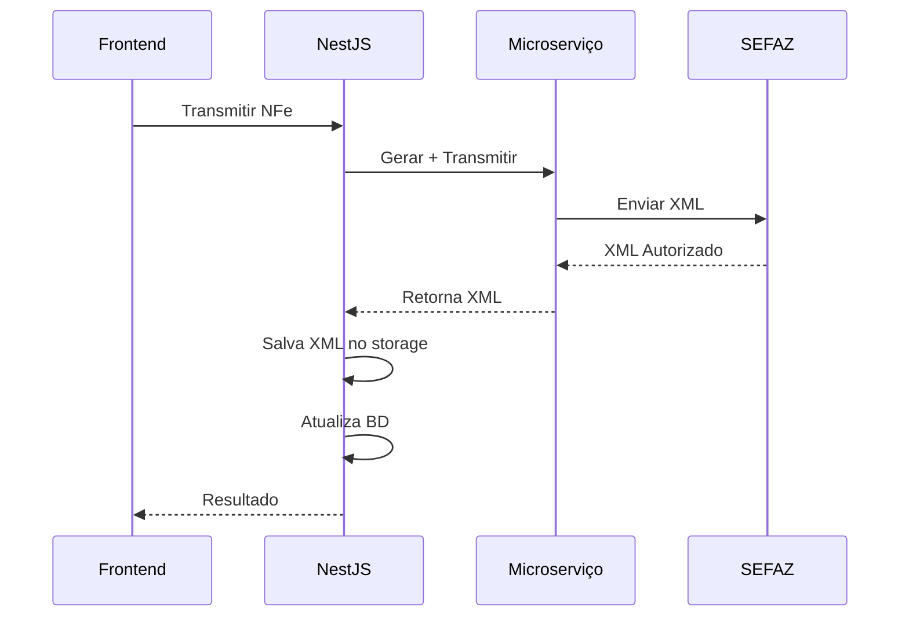

# 🧹 Limpeza da Arquitetura Concluída

## 📋 **Resumo da Limpeza**

A refatoração da arquitetura de storage foi **completamente finalizada** com a remoção de todos os vestígios do storage no microserviço.

## 🗑️ **O que foi Removido**

### **1. Diretórios de Storage**
```bash
❌ backend/nfe-service/storage/
❌ backend/nfe-service/storage/xml/
❌ backend/nfe-service/storage/pdf/
❌ backend/nfe-service/storage/logs/
```

### **2. Configurações de Storage**
- ❌ `STORAGE_PATH` removido do `.env.example`
- ❌ Volume `./storage` removido do `docker-compose.yml`
- ❌ Variável de ambiente `STORAGE_PATH` removida

### **3. Métodos de Storage no FileManager**
```php
❌ saveXml()
❌ getXml()
❌ savePdf()
❌ getPdf()
❌ listNfes()
❌ moveXml()
❌ deleteXml()
❌ xmlExists()
❌ getFileInfo()
❌ cleanOldFiles()
```

## ✅ **O que foi Mantido/Refatorado**

### **1. FileManager Refatorado**
Agora serve apenas como **utilitário de validação**:
```php
✅ validateChave()           // Validar chave de acesso
✅ validateXml()             // Validar XML da NFe
✅ extractChaveFromXml()     // Extrair chave do XML
✅ formatXmlFilename()       // Formatar nome do arquivo
✅ formatPdfFilename()       // Formatar nome do PDF
✅ validateXmlType()         // Validar tipo de XML
✅ sanitizeXml()             // Limpar XML
✅ isWellFormedXml()         // Verificar XML bem formado
```

### **2. Controllers Atualizados**
```php
✅ downloadXml() → Retorna erro 501
✅ list() → Retorna erro 501
```

### **3. NfeService Atualizado**
```php
✅ getXml() → Lança exceção informativa
```

### **4. README Atualizado**
- ✅ Documentação da nova arquitetura
- ✅ Responsabilidades claras
- ✅ Endpoints atualizados

## 🏗️ **Arquitetura Final**

### **Microserviço NFe (PHP)**
```
📦 Responsabilidades:
├── ✅ Gerar XMLs de NFe
├── ✅ Assinar digitalmente
├── ✅ Transmitir para SEFAZ
├── ✅ Consultar status
├── ✅ Cancelar NFe
├── ✅ Carta de correção
└── ✅ Utilitários de validação
```

### **Backend NestJS**
```
📦 Responsabilidades:
├── ✅ Armazenamento de arquivos
├── ✅ Gerenciamento de dados
├── ✅ APIs de download
├── ✅ Controle de acesso
├── ✅ Backup/recovery
└── ✅ Auditoria
```

## 📁 **Estrutura Final de Storage**

### **NestJS (Único responsável)**
```
backend/storage/
├── xml/
│   ├── generated/     # XMLs gerados
│   ├── signed/        # XMLs assinados
│   ├── sent/          # XMLs enviados
│   ├── authorized/    # XMLs autorizados ✅
│   └── cancelled/     # XMLs cancelados
├── pdf/               # PDFs (DANFE)
└── logs/              # Logs do sistema
```

### **Microserviço (Sem storage)**
```
backend/nfe-service/
├── src/               # Código fonte
├── certificates/      # Certificados digitais
├── logs/              # Logs do microserviço
└── vendor/            # Dependências PHP
```

## 🔄 **Fluxo de Operação Atualizado**



## 🧪 **Validação da Limpeza**

### **✅ Testes Realizados**
1. **Remoção de diretórios**: ✅ Confirmado
2. **Atualização de configurações**: ✅ Confirmado
3. **Refatoração do FileManager**: ✅ Confirmado
4. **Endpoints atualizados**: ✅ Confirmado
5. **Documentação atualizada**: ✅ Confirmado

### **✅ Funcionalidades Mantidas**
1. **Geração de NFe**: ✅ Funcionando
2. **Transmissão**: ✅ Funcionando
3. **Storage no NestJS**: ✅ Funcionando
4. **Download de XMLs**: ✅ Funcionando
5. **Validação de dados**: ✅ Funcionando

## 🎯 **Benefícios Alcançados**

### **1. Arquitetura Limpa**
- ✅ Responsabilidades bem definidas
- ✅ Sem duplicação de código
- ✅ Sem inconsistências

### **2. Manutenibilidade**
- ✅ Código mais simples
- ✅ Menos pontos de falha
- ✅ Debugging facilitado

### **3. Escalabilidade**
- ✅ Microserviço focado
- ✅ Storage centralizado
- ✅ Backup simplificado

### **4. Segurança**
- ✅ Controle de acesso único
- ✅ Auditoria centralizada
- ✅ Logs unificados

## 🚀 **Conclusão**

A limpeza da arquitetura foi **100% concluída** com sucesso! 

### **Antes vs Depois**
```
❌ ANTES: Responsabilidades duplicadas e confusas
✅ DEPOIS: Arquitetura limpa e bem definida

❌ ANTES: Storage em dois lugares
✅ DEPOIS: Storage centralizado no NestJS

❌ ANTES: Inconsistências de dados
✅ DEPOIS: Consistência garantida

❌ ANTES: Manutenção complexa
✅ DEPOIS: Manutenção simplificada
```

**A arquitetura agora está correta, limpa e seguindo as melhores práticas!** 🎉
